# Mukti Bazar MERN Application - Data Flow Diagrams

## Overview
This document contains Data Flow Diagrams (DFDs) for the Mukti Bazar e-commerce platform targeting agricultural wholesale products. The system is designed to break agricultural syndicates in Bangladesh by connecting producers (vendors) directly with shop owners (clients) under admin supervision.

## Application Architecture
- **Frontend**: React.js with Vite
- **Backend**: Node.js with Express.js
- **Database**: MongoDB
- **AI Service**: Python with TensorFlow
- **Payment**: SSLCommerz Sandbox
- **Real-time**: WebSocket connections
- **Authentication**: Firebase Auth

---

## Context Level DFD (Level 0)

```mermaid
graph TD
    %% External Entities
    Client[👤 Client<br/>Shop Owner]
    Vendor[🏪 Vendor<br/>Producer/Farmer]
    Admin[👑 Admin<br/>System Administrator]
    PaymentGateway[💳 SSLCommerz<br/>Payment Gateway]
    EmailService[📧 Email Service<br/>Nodemailer]
    FirebaseAuth[🔐 Firebase Auth<br/>Authentication]
    CloudinaryService[☁️ Cloudinary<br/>Image Storage]
    
    %% Main System
    MuktiBazar[(🌾 Mukti Bazar<br/>Agricultural E-commerce<br/>Platform)]
    
    %% Data Flows - Client
    Client -->|Registration/Login Data| MuktiBazar
    Client -->|Product Search Queries| MuktiBazar
    Client -->|Order Requests| MuktiBazar
    Client -->|Payment Information| MuktiBazar
    Client -->|Negotiation Messages| MuktiBazar
    Client -->|Feedback & Reviews| MuktiBazar
    MuktiBazar -->|Product Catalog| Client
    MuktiBazar -->|Order Confirmations| Client
    MuktiBazar -->|Negotiation Responses| Client
    MuktiBazar -->|Notifications| Client
    
    %% Data Flows - Vendor
    Vendor -->|Registration/KYC Documents| MuktiBazar
    Vendor -->|Product Information| MuktiBazar
    Vendor -->|Inventory Updates| MuktiBazar
    Vendor -->|Barter Proposals| MuktiBazar
    Vendor -->|Order Responses| MuktiBazar
    MuktiBazar -->|Verification Status| Vendor
    MuktiBazar -->|Order Notifications| Vendor
    MuktiBazar -->|Sales Analytics| Vendor
    MuktiBazar -->|Barter Opportunities| Vendor
    
    %% Data Flows - Admin
    Admin -->|Approval/Rejection Decisions| MuktiBazar
    Admin -->|System Configuration| MuktiBazar
    Admin -->|Fraud Investigation Commands| MuktiBazar
    MuktiBazar -->|Pending Approvals| Admin
    MuktiBazar -->|System Reports| Admin
    MuktiBazar -->|Fraud Alerts| Admin
    MuktiBazar -->|Analytics Dashboard| Admin
    
    %% External Service Flows
    MuktiBazar -->|Payment Processing Requests| PaymentGateway
    PaymentGateway -->|Payment Status| MuktiBazar
    MuktiBazar -->|Email Notifications| EmailService
    MuktiBazar -->|Authentication Requests| FirebaseAuth
    FirebaseAuth -->|User Tokens| MuktiBazar
    MuktiBazar -->|Image Upload Requests| CloudinaryService
    CloudinaryService -->|Image URLs| MuktiBazar
    
    classDef client fill:#e1f5fe
    classDef vendor fill:#f3e5f5
    classDef admin fill:#fff3e0
    classDef system fill:#e8f5e8
    classDef external fill:#fce4ec
    
    class Client client
    class Vendor vendor
    class Admin admin
    class MuktiBazar system
    class PaymentGateway,EmailService,FirebaseAuth,CloudinaryService external
```

---

## Level 1 DFD - Main System Processes

```mermaid
graph TD
    %% External Entities
    Client[👤 Client]
    Vendor[🏪 Vendor]
    Admin[👑 Admin]
    PaymentGateway[💳 SSLCommerz]
    EmailService[📧 Email Service]
    
    %% Main Processes
    P1[1.0<br/>User Management<br/>& Authentication]
    P2[2.0<br/>Product Management<br/>& Catalog]
    P3[3.0<br/>Order Processing<br/>& Management]
    P4[4.0<br/>Payment<br/>Processing]
    P5[5.0<br/>Communication<br/>& Messaging]
    P6[6.0<br/>Barter System<br/>Management]
    P7[7.0<br/>Admin Oversight<br/>& Approval]
    P8[8.0<br/>Analytics &<br/>Reporting]
    P9[9.0<br/>AI Services<br/>& Fraud Detection]
    P10[10.0<br/>Notification<br/>System]
    
    %% Data Stores
    DS1[(D1: Users)]
    DS2[(D2: Products)]
    DS3[(D3: Orders)]
    DS4[(D4: Messages)]
    DS5[(D5: Barter)]
    DS6[(D6: Payments)]
    DS7[(D7: Analytics)]
    DS8[(D8: Notifications)]
    DS9[(D9: Audit Logs)]
    
    %% Client Flows
    Client -->|Login/Register| P1
    Client -->|Browse Products| P2
    Client -->|Search Query| P2
    Client -->|Place Order| P3
    Client -->|Make Payment| P4
    Client -->|Send Messages| P5
    Client -->|Negotiate Price| P5
    
    %% Vendor Flows
    Vendor -->|Register/KYC| P1
    Vendor -->|Add Products| P2
    Vendor -->|Update Inventory| P2
    Vendor -->|Process Orders| P3
    Vendor -->|Create Barter| P6
    Vendor -->|Send Messages| P5
    
    %% Admin Flows
    Admin -->|Approve Users| P7
    Admin -->|Approve Products| P7
    Admin -->|View Reports| P8
    Admin -->|Monitor Fraud| P9
    
    %% Process to Data Store Flows
    P1 <-->|User Data| DS1
    P2 <-->|Product Data| DS2
    P3 <-->|Order Data| DS3
    P4 <-->|Payment Data| DS6
    P5 <-->|Message Data| DS4
    P6 <-->|Barter Data| DS5
    P7 <-->|Approval Data| DS1
    P7 <-->|Approval Data| DS2
    P8 <-->|Analytics Data| DS7
    P9 <-->|Fraud Data| DS9
    P10 <-->|Notification Data| DS8
    
    %% Process Interactions
    P1 -->|User Status| P2
    P2 -->|Product Info| P3
    P3 -->|Order Details| P4
    P4 -->|Payment Status| P3
    P5 -->|Negotiated Price| P3
    P6 -->|Barter Agreement| P3
    P7 -->|Approval Status| P1
    P7 -->|Approval Status| P2
    P8 -->|Usage Data| P9
    P9 -->|Fraud Alert| P7
    P9 -->|Risk Score| P3
    P10 -->|Send Notification| EmailService
    
    %% External Service Flows
    P4 <-->|Payment Request/Response| PaymentGateway
    P10 -->|Email Request| EmailService
    
    classDef process fill:#e3f2fd
    classDef datastore fill:#f1f8e9
    classDef external fill:#fce4ec
    classDef entity fill:#fff3e0
    
    class P1,P2,P3,P4,P5,P6,P7,P8,P9,P10 process
    class DS1,DS2,DS3,DS4,DS5,DS6,DS7,DS8,DS9 datastore
    class PaymentGateway,EmailService external
    class Client,Vendor,Admin entity
```

---

## Level 2 DFD - Detailed Process Breakdown

### 2.1 User Management & Authentication (Process 1.0)

```mermaid
graph TD
    %% External Entities
    Client[👤 Client]
    Vendor[🏪 Vendor]
    Admin[👑 Admin]
    FirebaseAuth[🔐 Firebase Auth]
    
    %% Sub-processes
    P11[1.1<br/>User Registration]
    P12[1.2<br/>Authentication<br/>& Login]
    P13[1.3<br/>Profile Management]
    P14[1.4<br/>KYC Verification]
    P15[1.5<br/>User Status<br/>Management]
    
    %% Data Stores
    DS1[(D1: Users)]
    DS14[(D14: KYC Documents)]
    DS15[(D15: User Sessions)]
    
    %% Flows
    Client -->|Registration Data| P11
    Vendor -->|Registration + KYC| P11
    P11 -->|User Profile| DS1
    P11 -->|KYC Documents| DS14
    P11 -->|Auth Request| FirebaseAuth
    
    Client -->|Login Credentials| P12
    Vendor -->|Login Credentials| P12
    Admin -->|Login Credentials| P12
    P12 <-->|Verify Token| FirebaseAuth
    P12 <-->|Session Data| DS15
    P12 <-->|User Data| DS1
    
    Client -->|Profile Updates| P13
    Vendor -->|Profile Updates| P13
    P13 <-->|Profile Data| DS1
    
    Admin -->|Review KYC| P14
    P14 <-->|KYC Status| DS1
    P14 <-->|Documents| DS14
    
    Admin -->|Ban/Unban User| P15
    P15 <-->|User Status| DS1
    P15 -->|Status Change| Client
    P15 -->|Status Change| Vendor
    
    classDef subprocess fill:#e8eaf6
    classDef datastore fill:#f1f8e9
    classDef external fill:#fce4ec
    classDef entity fill:#fff3e0
    
    class P11,P12,P13,P14,P15 subprocess
    class DS1,DS14,DS15 datastore
    class FirebaseAuth external
    class Client,Vendor,Admin entity
```

### 2.2 Product Management & Catalog (Process 2.0)

```mermaid
graph TD
    %% External Entities
    Vendor[🏪 Vendor]
    Client[👤 Client]
    Admin[👑 Admin]
    Cloudinary[☁️ Cloudinary]
    
    %% Sub-processes
    P21[2.1<br/>Product Creation]
    P22[2.2<br/>Product Approval]
    P23[2.3<br/>Inventory Management]
    P24[2.4<br/>Product Search<br/>& Browse]
    P25[2.5<br/>Featured Products<br/>Management]
    P26[2.6<br/>Product Analytics]
    
    %% Data Stores
    DS2[(D2: Products)]
    DS21[(D21: Product Images)]
    DS22[(D22: Categories)]
    DS23[(D23: Search Index)]
    DS7[(D7: Analytics)]
    
    %% Flows
    Vendor -->|Product Info| P21
    Vendor -->|Product Images| P21
    P21 -->|Image Upload| Cloudinary
    Cloudinary -->|Image URLs| P21
    P21 -->|New Product| DS2
    P21 -->|Image Data| DS21
    
    Admin -->|Approve/Reject| P22
    P22 <-->|Product Status| DS2
    P22 -->|Approval Status| Vendor
    
    Vendor -->|Stock Updates| P23
    P23 <-->|Inventory Data| DS2
    P23 -->|Stock Alerts| Vendor
    
    Client -->|Search Query| P24
    P24 <-->|Product Data| DS2
    P24 <-->|Search Index| DS23
    P24 -->|Search Results| Client
    
    Vendor -->|Feature Request| P25
    Admin -->|Feature Control| P25
    P25 <-->|Featured Status| DS2
    P25 -->|Featured Products| Client
    
    P26 <-->|Product Metrics| DS2
    P26 <-->|Analytics Data| DS7
    P26 -->|Product Reports| Vendor
    P26 -->|System Reports| Admin
    
    classDef subprocess fill:#e8eaf6
    classDef datastore fill:#f1f8e9
    classDef external fill:#fce4ec
    classDef entity fill:#fff3e0
    
    class P21,P22,P23,P24,P25,P26 subprocess
    class DS2,DS21,DS22,DS23,DS7 datastore
    class Cloudinary external
    class Vendor,Client,Admin entity
```

### 2.3 Order Processing & Management (Process 3.0)

```mermaid
graph TD
    %% External Entities
    Client[👤 Client]
    Vendor[🏪 Vendor]
    Admin[👑 Admin]
    
    %% Sub-processes
    P31[3.1<br/>Cart Management]
    P32[3.2<br/>Order Creation]
    P33[3.3<br/>Order Validation<br/>& Fraud Check]
    P34[3.4<br/>Order Processing]
    P35[3.5<br/>Order Fulfillment]
    P36[3.6<br/>Order Tracking]
    
    %% Data Stores
    DS3[(D3: Orders)]
    DS31[(D31: Cart)]
    DS2[(D2: Products)]
    DS32[(D32: Order History)]
    DS9[(D9: Audit Logs)]
    
    %% External Process
    P9[9.0<br/>AI Fraud<br/>Detection]
    
    %% Flows
    Client -->|Add to Cart| P31
    P31 <-->|Cart Data| DS31
    P31 <-->|Product Info| DS2
    P31 -->|Cart Contents| Client
    
    Client -->|Checkout Request| P32
    P32 <-->|Cart Data| DS31
    P32 -->|New Order| DS3
    P32 -->|Order Created| P33
    
    P33 -->|Fraud Check| P9
    P9 -->|Risk Score| P33
    P33 -->|High Risk Alert| Admin
    P33 -->|Validated Order| P34
    P33 <-->|Audit Data| DS9
    
    P34 -->|Order Notification| Vendor
    P34 <-->|Order Status| DS3
    P34 <-->|Inventory Update| DS2
    P34 -->|Order Confirmed| Client
    
    Vendor -->|Fulfill Order| P35
    P35 <-->|Order Status| DS3
    P35 -->|Fulfillment Status| Client
    
    Client -->|Track Order| P36
    Vendor -->|Update Status| P36
    P36 <-->|Order Status| DS3
    P36 -->|Order Updates| Client
    P36 <-->|Order History| DS32
    
    classDef subprocess fill:#e8eaf6
    classDef datastore fill:#f1f8e9
    classDef external fill:#fce4ec
    classDef entity fill:#fff3e0
    classDef externalprocess fill:#ffecb3
    
    class P31,P32,P33,P34,P35,P36 subprocess
    class DS3,DS31,DS2,DS32,DS9 datastore
    class Client,Vendor,Admin entity
    class P9 externalprocess
```

### 2.4 Communication & Messaging (Process 5.0)

```mermaid
graph TD
    %% External Entities
    Client[👤 Client]
    Vendor[🏪 Vendor]
    WebSocket[🔌 WebSocket<br/>Real-time]
    
    %% Sub-processes
    P51[5.1<br/>Message Creation<br/>& Sending]
    P52[5.2<br/>Real-time Message<br/>Delivery]
    P53[5.3<br/>Price Negotiation<br/>Management]
    P54[5.4<br/>Chat History<br/>Management]
    P55[5.5<br/>Message<br/>Moderation]
    
    %% Data Stores
    DS4[(D4: Messages)]
    DS51[(D51: Conversations)]
    DS52[(D52: Negotiations)]
    DS53[(D53: Chat History)]
    
    %% Flows
    Client -->|Send Message| P51
    Vendor -->|Send Message| P51
    P51 -->|New Message| DS4
    P51 -->|Update Conversation| DS51
    P51 -->|Message to Deliver| P52
    
    P52 -->|Real-time Message| WebSocket
    WebSocket -->|Message Delivered| Client
    WebSocket -->|Message Delivered| Vendor
    
    Client -->|Negotiation Offer| P53
    Vendor -->|Counter Offer| P53
    P53 <-->|Negotiation Data| DS52
    P53 <-->|Negotiation Messages| DS4
    P53 -->|Final Agreement| Client
    P53 -->|Final Agreement| Vendor
    
    Client -->|View History| P54
    Vendor -->|View History| P54
    P54 <-->|Chat Data| DS53
    P54 <-->|Message Data| DS4
    P54 -->|Chat History| Client
    P54 -->|Chat History| Vendor
    
    P55 <-->|Message Content| DS4
    P55 -->|Moderation Alert| P51
    
    classDef subprocess fill:#e8eaf6
    classDef datastore fill:#f1f8e9
    classDef external fill:#fce4ec
    classDef entity fill:#fff3e0
    
    class P51,P52,P53,P54,P55 subprocess
    class DS4,DS51,DS52,DS53 datastore
    class WebSocket external
    class Client,Vendor entity
```

### 2.5 Barter System Management (Process 6.0)

```mermaid
graph TD
    %% External Entities
    VendorA[🏪 Vendor A<br/>Proposer]
    VendorB[🏪 Vendor B<br/>Receiver]
    
    %% Sub-processes
    P61[6.1<br/>Barter Proposal<br/>Creation]
    P62[6.2<br/>Barter Matching<br/>& Discovery]
    P63[6.3<br/>Barter Negotiation<br/>& Agreement]
    P64[6.4<br/>Barter Execution<br/>& Exchange]
    P65[6.5<br/>Barter History<br/>& Tracking]
    
    %% Data Stores
    DS5[(D5: Barter)]
    DS2[(D2: Products)]
    DS61[(D61: Barter Proposals)]
    DS62[(D62: Barter Agreements)]
    DS63[(D63: Barter History)]
    
    %% Flows
    VendorA -->|Create Proposal| P61
    P61 <-->|Product Info| DS2
    P61 -->|New Proposal| DS61
    P61 -->|Proposal Data| DS5
    
    VendorB -->|Search Opportunities| P62
    P62 <-->|Barter Data| DS5
    P62 <-->|Product Match| DS2
    P62 -->|Matching Opportunities| VendorB
    
    VendorA -->|Negotiate Terms| P63
    VendorB -->|Accept/Counter| P63
    P63 <-->|Negotiation Data| DS5
    P63 -->|Agreement Reached| DS62
    P63 -->|Agreement Status| VendorA
    P63 -->|Agreement Status| VendorB
    
    VendorA -->|Confirm Exchange| P64
    VendorB -->|Confirm Exchange| P64
    P64 <-->|Inventory Update| DS2
    P64 <-->|Agreement Data| DS62
    P64 -->|Exchange Complete| VendorA
    P64 -->|Exchange Complete| VendorB
    
    VendorA -->|View History| P65
    VendorB -->|View History| P65
    P65 <-->|Historical Data| DS63
    P65 <-->|Barter Records| DS5
    P65 -->|Barter History| VendorA
    P65 -->|Barter History| VendorB
    
    classDef subprocess fill:#e8eaf6
    classDef datastore fill:#f1f8e9
    classDef entity fill:#fff3e0
    
    class P61,P62,P63,P64,P65 subprocess
    class DS5,DS2,DS61,DS62,DS63 datastore
    class VendorA,VendorB entity
```

---

## System Integration Flow

---

## Key Features Data Flow Summary

1. **User Onboarding Flow**: Registration → KYC Verification → Admin Approval
2. **Product Lifecycle**: Vendor Upload → Admin Approval → Client Purchase
3. **Order Processing**: Cart → Checkout → Fraud Check → Payment → Fulfillment
4. **Communication**: Real-time messaging between Users and Vendors
5. **Barter System**: Vendor-to-Vendor product exchange system
6. **Fraud Prevention**: AI-powered risk scoring and admin oversight
7. **Analytics**: Real-time monitoring and business intelligence

This comprehensive DFD structure shows how the Mukti Bazar platform manages agricultural wholesale commerce while preventing syndicate manipulation through proper verification and oversight mechanisms.