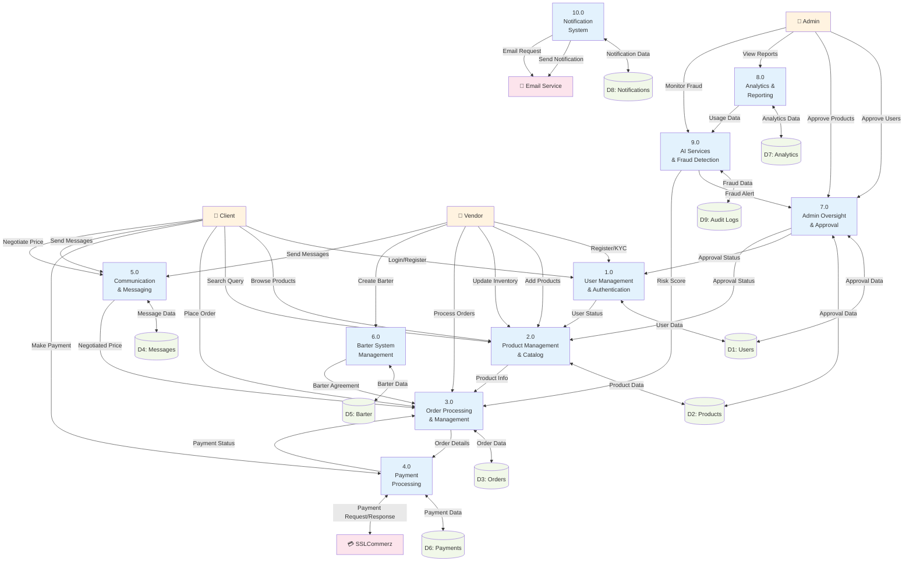
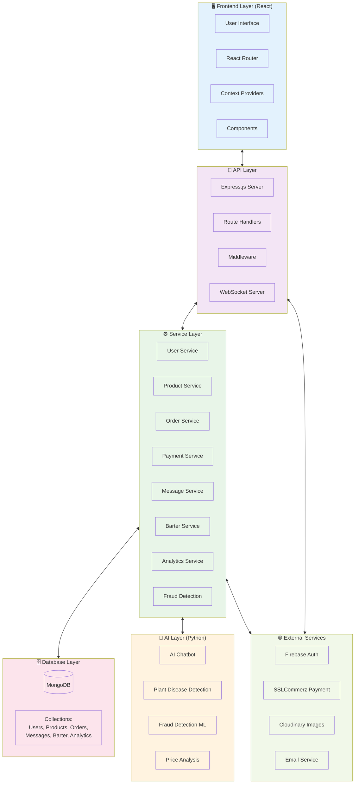

# Mukti Bazar MERN - Data Flow Diagrams Mermaid Code

## Context Level DFD (Level 0)

```mermaid
graph TD
    %% External Entities
    Client[👤 Client<br/>Shop Owner]
    Vendor[🏪 Vendor<br/>Producer/Farmer]
    Admin[👑 Admin<br/>System Administrator]
    PaymentGateway[💳 SSLCommerz<br/>Payment Gateway]
    EmailService[📧 Email Service<br/>Nodemailer]
    FirebaseAuth[🔐 Firebase Auth<br/>Authentication]
    CloudinaryService[☁️ Cloudinary<br/>Image Storage]
    
    %% Main System
    MuktiBazar[(🌾 Mukti Bazar<br/>Agricultural E-commerce<br/>Platform)]
    
    %% Data Flows - Client
    Client -->|Registration/Login Data| MuktiBazar
    Client -->|Product Search Queries| MuktiBazar
    Client -->|Order Requests| MuktiBazar
    Client -->|Payment Information| MuktiBazar
    Client -->|Negotiation Messages| MuktiBazar
    Client -->|Feedback & Reviews| MuktiBazar
    MuktiBazar -->|Product Catalog| Client
    MuktiBazar -->|Order Confirmations| Client
    MuktiBazar -->|Negotiation Responses| Client
    MuktiBazar -->|Notifications| Client
    
    %% Data Flows - Vendor
    Vendor -->|Registration/KYC Documents| MuktiBazar
    Vendor -->|Product Information| MuktiBazar
    Vendor -->|Inventory Updates| MuktiBazar
    Vendor -->|Barter Proposals| MuktiBazar
    Vendor -->|Order Responses| MuktiBazar
    MuktiBazar -->|Verification Status| Vendor
    MuktiBazar -->|Order Notifications| Vendor
    MuktiBazar -->|Sales Analytics| Vendor
    MuktiBazar -->|Barter Opportunities| Vendor
    
    %% Data Flows - Admin
    Admin -->|Approval/Rejection Decisions| MuktiBazar
    Admin -->|System Configuration| MuktiBazar
    Admin -->|Fraud Investigation Commands| MuktiBazar
    MuktiBazar -->|Pending Approvals| Admin
    MuktiBazar -->|System Reports| Admin
    MuktiBazar -->|Fraud Alerts| Admin
    MuktiBazar -->|Analytics Dashboard| Admin
    
    %% External Service Flows
    MuktiBazar -->|Payment Processing Requests| PaymentGateway
    PaymentGateway -->|Payment Status| MuktiBazar
    MuktiBazar -->|Email Notifications| EmailService
    MuktiBazar -->|Authentication Requests| FirebaseAuth
    FirebaseAuth -->|User Tokens| MuktiBazar
    MuktiBazar -->|Image Upload Requests| CloudinaryService
    CloudinaryService -->|Image URLs| MuktiBazar
    
    classDef client fill:#e1f5fe
    classDef vendor fill:#f3e5f5
    classDef admin fill:#fff3e0
    classDef system fill:#e8f5e8
    classDef external fill:#fce4ec
    
    class Client client
    class Vendor vendor
    class Admin admin
    class MuktiBazar system
    class PaymentGateway,EmailService,FirebaseAuth,CloudinaryService external
```

## Level 1 DFD - Main System Processes

```mermaid
graph TD
    %% External Entities
    Client[👤 Client]
    Vendor[🏪 Vendor]
    Admin[👑 Admin]
    PaymentGateway[💳 SSLCommerz]
    EmailService[📧 Email Service]
    
    %% Main Processes
    P1[1.0<br/>User Management<br/>& Authentication]
    P2[2.0<br/>Product Management<br/>& Catalog]
    P3[3.0<br/>Order Processing<br/>& Management]
    P4[4.0<br/>Payment<br/>Processing]
    P5[5.0<br/>Communication<br/>& Messaging]
    P6[6.0<br/>Barter System<br/>Management]
    P7[7.0<br/>Admin Oversight<br/>& Approval]
    P8[8.0<br/>Analytics &<br/>Reporting]
    P9[9.0<br/>AI Services<br/>& Fraud Detection]
    P10[10.0<br/>Notification<br/>System]
    
    %% Data Stores
    DS1[(D1: Users)]
    DS2[(D2: Products)]
    DS3[(D3: Orders)]
    DS4[(D4: Messages)]
    DS5[(D5: Barter)]
    DS6[(D6: Payments)]
    DS7[(D7: Analytics)]
    DS8[(D8: Notifications)]
    DS9[(D9: Audit Logs)]
    
    %% Client Flows
    Client -->|Login/Register| P1
    Client -->|Browse Products| P2
    Client -->|Search Query| P2
    Client -->|Place Order| P3
    Client -->|Make Payment| P4
    Client -->|Send Messages| P5
    Client -->|Negotiate Price| P5
    
    %% Vendor Flows
    Vendor -->|Register/KYC| P1
    Vendor -->|Add Products| P2
    Vendor -->|Update Inventory| P2
    Vendor -->|Process Orders| P3
    Vendor -->|Create Barter| P6
    Vendor -->|Send Messages| P5
    
    %% Admin Flows
    Admin -->|Approve Users| P7
    Admin -->|Approve Products| P7
    Admin -->|View Reports| P8
    Admin -->|Monitor Fraud| P9
    
    %% Process to Data Store Flows
    P1 <-->|User Data| DS1
    P2 <-->|Product Data| DS2
    P3 <-->|Order Data| DS3
    P4 <-->|Payment Data| DS6
    P5 <-->|Message Data| DS4
    P6 <-->|Barter Data| DS5
    P7 <-->|Approval Data| DS1
    P7 <-->|Approval Data| DS2
    P8 <-->|Analytics Data| DS7
    P9 <-->|Fraud Data| DS9
    P10 <-->|Notification Data| DS8
    
    %% Process Interactions
    P1 -->|User Status| P2
    P2 -->|Product Info| P3
    P3 -->|Order Details| P4
    P4 -->|Payment Status| P3
    P5 -->|Negotiated Price| P3
    P6 -->|Barter Agreement| P3
    P7 -->|Approval Status| P1
    P7 -->|Approval Status| P2
    P8 -->|Usage Data| P9
    P9 -->|Fraud Alert| P7
    P9 -->|Risk Score| P3
    P10 -->|Send Notification| EmailService
    
    %% External Service Flows
    P4 <-->|Payment Request/Response| PaymentGateway
    P10 -->|Email Request| EmailService
    
    classDef process fill:#e3f2fd
    classDef datastore fill:#f1f8e9
    classDef external fill:#fce4ec
    classDef entity fill:#fff3e0
    
    class P1,P2,P3,P4,P5,P6,P7,P8,P9,P10 process
    class DS1,DS2,DS3,DS4,DS5,DS6,DS7,DS8,DS9 datastore
    class PaymentGateway,EmailService external
    class Client,Vendor,Admin entity
```

## System Integration Architecture

```mermaid
graph TB
    %% Frontend Layer
    subgraph Frontend["🖥️ Frontend Layer (React)"]
        UI[User Interface]
        Router[React Router]
        Context[Context Providers]
        Components[Components]
    end
    
    %% API Layer
    subgraph API["🔌 API Layer"]
        Express[Express.js Server]
        Routes[Route Handlers]
        Middleware[Middleware]
        WebSockets[WebSocket Server]
    end
    
    %% Service Layer
    subgraph Services["⚙️ Service Layer"]
        UserService[User Service]
        ProductService[Product Service]
        OrderService[Order Service]
        PaymentService[Payment Service]
        MessageService[Message Service]
        BarterService[Barter Service]
        AnalyticsService[Analytics Service]
        FraudService[Fraud Detection]
    end
    
    %% AI Layer
    subgraph AI["🤖 AI Layer (Python)"]
        ChatBot[AI Chatbot]
        PlantDisease[Plant Disease Detection]
        FraudDetection[Fraud Detection ML]
        PriceAnalysis[Price Analysis]
    end
    
    %% Database Layer
    subgraph Database["🗄️ Database Layer"]
        MongoDB[(MongoDB)]
        Collections[Collections:<br/>Users, Products, Orders,<br/>Messages, Barter, Analytics]
    end
    
    %% External Services
    subgraph External["🌐 External Services"]
        Firebase[Firebase Auth]
        SSLCommerz[SSLCommerz Payment]
        Cloudinary[Cloudinary Images]
        EmailService[Email Service]
    end
    
    %% Connections
    Frontend <--> API
    API <--> Services
    Services <--> Database
    Services <--> AI
    Services <--> External
    API <--> External
    
    classDef frontend fill:#e3f2fd
    classDef api fill:#f3e5f5
    classDef services fill:#e8f5e8
    classDef ai fill:#fff3e0
    classDef database fill:#fce4ec
    classDef external fill:#f1f8e9
    
    class Frontend,UI,Router,Context,Components frontend
    class API,Express,Routes,Middleware,WebSockets api
    class Services,UserService,ProductService,OrderService,PaymentService,MessageService,BarterService,AnalyticsService,FraudService services
    class AI,ChatBot,PlantDisease,FraudDetection,PriceAnalysis ai
    class Database,MongoDB,Collections database
    class External,Firebase,SSLCommerz,Cloudinary,EmailService external
```